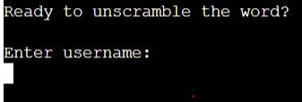
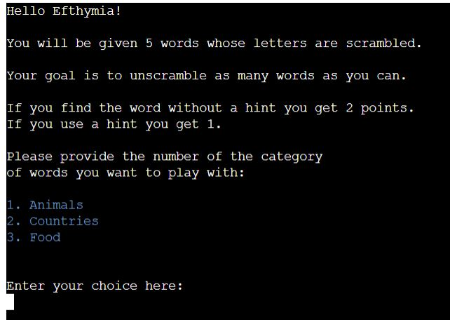
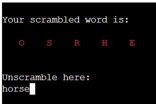
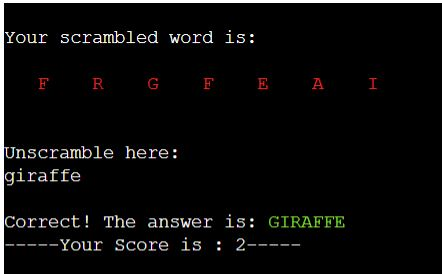
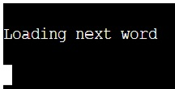
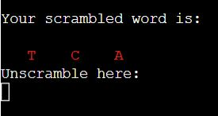
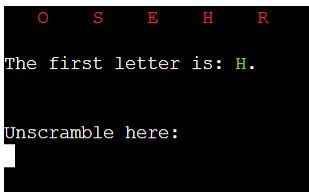
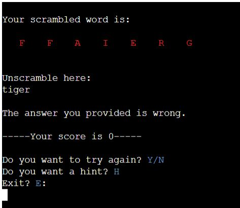
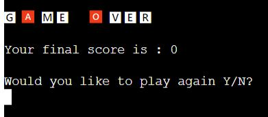

# [UNSCRAMBLE THE WORD](https://unscramble-the-word-17d105fa8470.herokuapp.com)

Unscramble the word is a game where the player is called to find the word whose letters have been scrambled. If the player gets it right withour using a hint he/she gets 2 points. If he/ she gets a hint, which is the first letter, then he/she gets one point. 

## UX

I chose to use different fonts for the tile of the game as well as the end of the game so as to make it clear where the game begins and ends. I chose a font that reminded me of the very well known game "Scramble" which also is a game of finding words given some letters. 
The scrambled word is red, meaning that the letters are in the wrong order, and is appearing green when the player finds the right answer.

## User Stories

🛑🛑🛑🛑🛑 START OF NOTES (to be deleted) 🛑🛑🛑🛑🛑

In this section, list all of your user stories for the project.

🛑🛑🛑🛑🛑 END OF NOTES (to be deleted) 🛑🛑🛑🛑🛑

### New Site Users

- As a new site user, I would like to ____________, so that I can ____________.
- As a new site user, I would like to ____________, so that I can ____________.
- As a new site user, I would like to ____________, so that I can ____________.
- As a new site user, I would like to ____________, so that I can ____________.
- As a new site user, I would like to ____________, so that I can ____________.

### Returning Site Users

- As a returning site user, I would like to ____________, so that I can ____________.
- As a returning site user, I would like to ____________, so that I can ____________.
- As a returning site user, I would like to ____________, so that I can ____________.
- As a returning site user, I would like to ____________, so that I can ____________.
- As a returning site user, I would like to ____________, so that I can ____________.

## Features


### Existing Features

- **Title for the game**

    - The title of the game printed in different letters to stick out.


- **Username**

    - The game asks for the username so that it can greet the player and welcome him/her to the game. No numbers alloed here.



- **Categoty choice**

    - To narrow down the range of words and make it easier for the player to direct his/hers thoughts towards a a specific group of words I added categories. The player chooses one and knows that the words he/she is going to play with are of that category.




- **Scrambled Word**

    - The player gets the letters of the word who are capitals, printed in red and with a space between them so as to make them stick out of the rest of the text. It is these letters he/she is going to play with.


- **Unscramble here**

    - The player is asked to find the word. Even if he writes the answer in lowercase the game is turning them to upper to match the word.



- **If the player gets it right - Score update**

    - If the player gets it right a message that the answer is correct appears, the player gets 2 points and moves on to the next word.



- **If the player's answer is wrong**

    - If the player's answer is wrong then he gets 4 options. 
    1. To continue with same word without a hint.
    2. To skip the word and move on to the next one.
    3. To get a hint.
    4. To exit the game.


- **If the player wants to try again**

    - If the player wants to try again without getting a hint still aiming for the 2 points then he/she tries again.


- **If the player wants to move on**

    - If the player wants to move on then the next word appears and he/she gets no points.




- **If the player wants a hint**

    - If the player wants a hint then he/she is given the first letter of the word. Now he/she can only get 1 point if he/she finds the right answer. There are no more hints so if he/she still gets it wrong he/she can be reminded of the hint again.




- **If the player wants to exit**

    - If the player wants to exit he/she press "E" and exit the game.

- **If there are no more words to play then the game is over**

    - There are 5 words in each category. If the player has played or skipped all of them, then the game is over and his/hers final score is printed along with the choice to play again. If the player chooses to play again then the game starts over if not he/she exits the game.




### Future Features

- More features could be added in the future such as more categories to choose from:
    - This would challenge the player based on his/hers interests.
- More hints could be offered.
    - This would cause a more complex score-keeping and make it more interesting. It could reveal letters of the word at random places inside the word to make it more interesting (for example if the word was "TABLE" after 2 hints it could appear like this : _ A _ _ E and the score would be updated accordingly).

## Tools & Technologies Used

- [Python](https://www.python.org) used as the back-end programming language.
- [Git](https://git-scm.com) used for version control. (`git add`, `git commit`, `git push`)
- [GitHub](https://github.com) used for secure online code storage.
- [GitHub Pages](https://pages.github.com) used for hosting the deployed front-end site.
- [Gitpod](https://gitpod.io) used as a cloud-based IDE for development.
- [Heroku](https://www.heroku.com) used for hosting the deployed back-end site.


## Data Model

### Flowchart

To follow best practice, a flowchart was created for the app's logic,
and mapped out before coding began using a free version of
[Lucidchart](https://www.lucidchart.com/pages/ER-diagram-symbols-and-meaning) and/or [Draw.io](https://www.draw.io).

Below is the flowchart of the main process of this Python program. It shows the entire cycle of the program.


### Classes & Functions

The program uses classes as a blueprint for the project's objects (OOP). This allows for the object to be reusable.

```python
class Person:
    """ Insert docstring comments here """
    def __init__(self, name, age, health, inventory):
        self.name = name
        self.age = age
        self.health = health
        self.inventory = inventory
```

The primary functions used on this application are:

- `get username()`
    -   Get the players username.
- `reset_game()`
    -   Resets all values when the game is over and the player chooses to play again.
- `category_choice()`
    -   Asks the players input on what category he/she wants to play with.
- `scramble_word`
    -   Chooses randomly an item from the list chosen.
    -   Takes it out of the list.
    -   Shuffles the item/word.
    -   Calls the player's answer function.
    -   Calls the play again function when there are no items left on the list..
- `players_answer()`
    -   Players input and validation.
- `validation_words()`
    -   Validates the answer and offers a hint.
    -   Raises error if the input is not correct.
    -   Gives the option to retry.
    -   Updates the score.
- `play_again()`
    - Gives the option to play again when the game is over.
- `main()`
    - Run all program functions.

### Imports

I've used the following Python packages and external imported packages.

- `time`: used for adding time delays
- `os`: used for adding a `clear()` function
- `random`: used to get a random choice from a list

## Testing

For all testing, please refer to the [TESTING.md](TESTING.md) file.

## Deployment

Code Institute has provided a [template](https://github.com/Code-Institute-Org/python-essentials-template) to display the terminal view of this backend application in a modern web browser.
This is to improve the accessibility of the project to others.

The live deployed application can be found deployed on [Heroku](https://unscramble-the-word-17d105fa8470.herokuapp.com).

### Heroku Deployment

This project uses [Heroku](https://www.heroku.com), a platform as a service (PaaS) that enables developers to build, run, and operate applications entirely in the cloud.

Deployment steps are as follows, after account setup:

- Select **New** in the top-right corner of your Heroku Dashboard, and select **Create new app** from the dropdown menu.
- Your app name must be unique, and then choose a region closest to you (EU or USA), and finally, select **Create App**.
- From the new app **Settings**, click **Reveal Config Vars**, and set the value of KEY to `PORT`, and the value to `8000` then select *add*.
- If using any confidential credentials, such as CREDS.JSON, then these should be pasted in the Config Variables as well.
- Further down, to support dependencies, select **Add Buildpack**.
- The order of the buildpacks is important, select `Python` first, then `Node.js` second. (if they are not in this order, you can drag them to rearrange them)

Heroku needs two additional files in order to deploy properly.

- requirements.txt
- Procfile

You can install this project's **requirements** (where applicable) using:

- `pip3 install -r requirements.txt`

If you have your own packages that have been installed, then the requirements file needs updated using:

- `pip3 freeze --local > requirements.txt`

The **Procfile** can be created with the following command:

- `echo web: node index.js > Procfile`

For Heroku deployment, follow these steps to connect your own GitHub repository to the newly created app:

Either:

- Select **Automatic Deployment** from the Heroku app.

Or:

- In the Terminal/CLI, connect to Heroku using this command: `heroku login -i`
- Set the remote for Heroku: `heroku git:remote -a app_name` (replace *app_name* with your app name)
- After performing the standard Git `add`, `commit`, and `push` to GitHub, you can now type:
	- `git push heroku main`

The frontend terminal should now be connected and deployed to Heroku!

### Local Deployment

This project can be cloned or forked in order to make a local copy on your own system.

For either method, you will need to install any applicable packages found within the *requirements.txt* file.

- `pip3 install -r requirements.txt`.

If using any confidential credentials, such as `CREDS.json` or `env.py` data, these will need to be manually added to your own newly created project as well.

#### Cloning

You can clone the repository by following these steps:

1. Go to the [GitHub repository](https://github.com/EfthymiaKakoulidou/unscramble-the-word) 
2. Locate the Code button above the list of files and click it 
3. Select if you prefer to clone using HTTPS, SSH, or GitHub CLI and click the copy button to copy the URL to your clipboard
4. Open Git Bash or Terminal
5. Change the current working directory to the one where you want the cloned directory
6. In your IDE Terminal, type the following command to clone my repository:
	- `git clone https://github.com/EfthymiaKakoulidou/unscramble-the-word.git`
7. Press Enter to create your local clone.

Alternatively, if using Gitpod, you can click below to create your own workspace using this repository.

[](https://gitpod.io/#https://github.com/EfthymiaKakoulidou/unscramble-the-word)

Please note that in order to directly open the project in Gitpod, you need to have the browser extension installed.
A tutorial on how to do that can be found [here](https://www.gitpod.io/docs/configure/user-settings/browser-extension).

#### Forking

By forking the GitHub Repository, we make a copy of the original repository on our GitHub account to view and/or make changes without affecting the original owner's repository.
You can fork this repository by using the following steps:

1. Log in to GitHub and locate the [GitHub Repository](https://github.com/EfthymiaKakoulidou/unscramble-the-word)
2. At the top of the Repository (not top of page) just above the "Settings" Button on the menu, locate the "Fork" Button.
3. Once clicked, you should now have a copy of the original repository in your own GitHub account!

### Local VS Deployment

🛑🛑🛑🛑🛑 START OF NOTES (to be deleted) 🛑🛑🛑🛑🛑

Use this space to discuss any differences between the local version you've developed, and the live deployment site on Heroku.

🛑🛑🛑🛑🛑 END OF NOTES (to be deleted) 🛑🛑🛑🛑🛑

## Credits

### Content

| Source | Location | Notes |
| --- | --- | --- |
| [Markdown Builder](https://tim.2bn.dev/markdown-builder) | README and TESTING | tool to help generate the Markdown files |
| [W3Schools](https://www.w3schools.com/howto/howto_js_topnav_responsive.asp) | entire site | python functions, loops, lists etc |
| [StackOverflow](https://stackoverflow.com/a/2450976) | entire site | troubleshooting everything |
| [YouTube](https://www.youtube.com/watch?v=u51Zjlnui4Y) | PP3 terminal | tutorial for adding color to the Python terminal |

### Media

| Source | Location | Type | Notes |
| --- | --- | --- | --- |
| [Fsymbols](https://fsymbols.com/) | Title and game over | image | start and end |


### Acknowledgements

- I would like to thank my Code Institute mentor, [Tim Nelson](https://github.com/TravelTimN) for his support throughout the development of this project.
- I would like to thank the [Code Institute](https://codeinstitute.net) tutor team for their assistance with troubleshooting and debugging some project issues.
- I would like to thank the [Code Institute Slack community](https://code-institute-room.slack.com) for the moral support; it kept me going.
- I would like to thank my partner Alexandros, allowing me to make this transition into software development.

