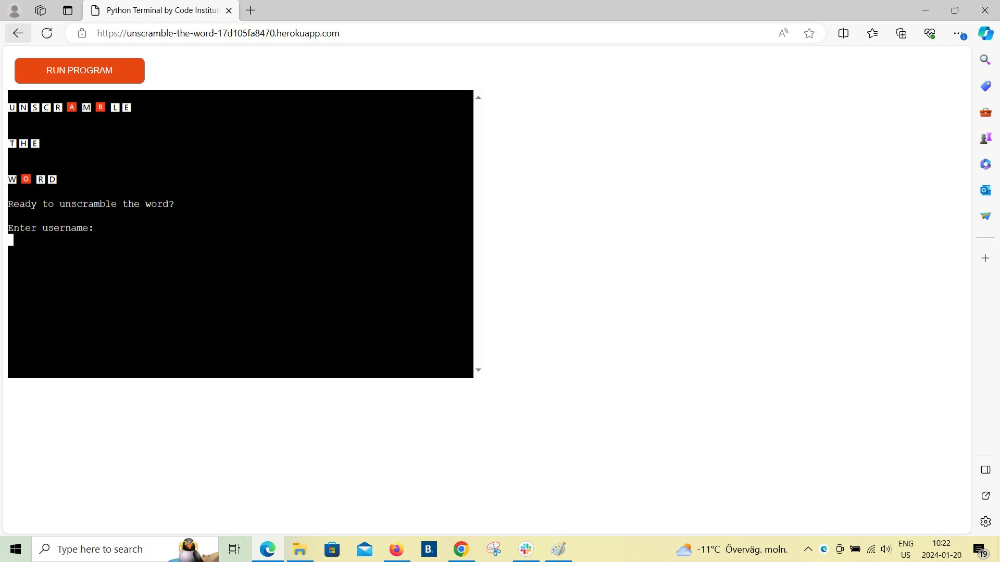
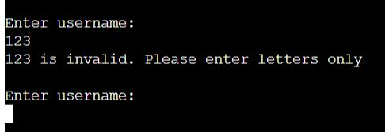
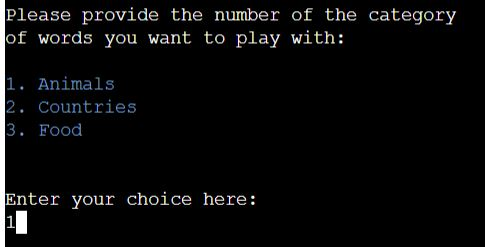
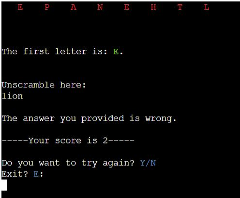
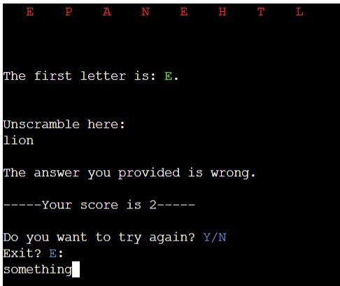
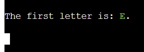
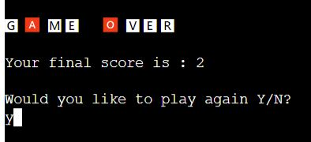
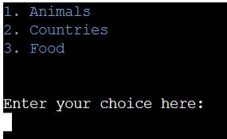
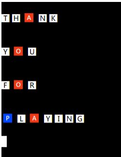

# Testing

## Code Validation

### Python

I have used the recommended [PEP8 CI Python Linter](https://pep8ci.herokuapp.com) to validate all of my Python files.

| File | CI URL | Screenshot | Notes |
| --- | --- | --- | --- |
| run.py | [PEP8 CI](https://pep8ci.herokuapp.com/https://raw.githubusercontent.com/EfthymiaKakoulidou/unscramble-the-word/main/run.py) |  | W291 trailing whitespace-fixed  |

## Browser Compatibility

I've tested my deployed project on multiple browsers to check for compatibility issues.

| Browser | Image | Notes |
| --- | --- | --- |
| Chrome |  | Works as expected |
| Firefox |  | Font does not appear as expected |
| Edge |  | Works as expected |

## Responsiveness

I've tested my deployed project on multiple devices to check for responsiveness issues.

| Device | Image | Notes |
| --- | --- | --- |
| Desktop |  | Works as expected |
| Mobile |  | Works as expected |
| Mobile |  | Works as expected |

## Lighthouse Audit

I've tested my deployed project using the Lighthouse Audit tool to check for any major issues.

| Game | Desktop | Notes |
| --- | --- | --- |
| Game |  | No warnings |

## Defensive Programming

Defensive programming was manually tested with the below user acceptance testing:

| Function | Expectation | Test | Result | Fix | Screenshot |
| --- | --- | --- | --- | --- | --- |
| Username | | | | | |
| | Feature is expected to display username when the user writes it | Tested the feature by typing a name | The feature behaved as expected, and it printed the username | Test concluded and passed |  |
| | Feature is expected to display username when the user writes it | Tested the feature by writing numbers | The feature gives an error | I handled the error by setting it to "the answer is invalid" |   |
| Category choice | | | | | |
| | Feature is expected to accept just the numbers 1,2 or 3 as an answer | Tested the feature by typing 1,2 or 3 | The feature behaved as expected, and it chose a category | Test concluded and passed |  |
| | Feature is expected to accept just the numbers 1,2 or 3 as an answer | Tested the feature by typing anything else | The feature throws an error | I handled the error with the message that the answer is invalid and the option for the player to try again. |  |
| Scramble the word | | | | | |
| | Feature is expected to take a word from the category chosen and shuffle its letters | Tested the feature by playing | The feature behaved as expected, and it printed the shuffled word | Test concluded and passed |  |
| Validation of the player's answer| | | | | |
| | Feature is expected to check if the player's answer is correct or not and give the points accordingly| Tested the feature by giving the right answer | The feature behaved as expected, and it printed that it is correct gave the player 2 points and moved on to the next word | Test concluded and passed |   |
| | Feature is expected to check if the player's answer is correct or not | Tested the feature by giving the wrong answer | The feature behaved as expected and gave the player the 4 options(retry, skip, hint and exit) | Test concluded and passed |   |
| If the player's answer is wrong he gets the 4 options "Y", "N", "H", "E" | | | | | |
| | If the player types "Y" | Tested the feature by typing "Y" | The feature behaved as expected, and it gave the player another try. | Test concluded and passed |  |
| | If the player types "N" | Tested the feature by typing "N" | The feature behaved as expected, and moved on to the next word. | Test concluded and passed |   |
| | If the player types "H" | Tested the feature by typing "H" | The feature behaved as expected, and gave the player the hint. | Test concluded and passed |   |
| | If the player types "E" | Tested the feature by typing "E" | The feature behaved as expected, and exited the game | Test concluded and passed |  |
| | If the player does not type "Y", "N", "H", "E" | Tested the feature by typing something else | The feature behaved as expected, and throwed an error that the answer is invalid. | Test concluded and passed |  |
| If the player's answer is still wrong after the first time around and after getting a hint he gets again 4 options "Y", "N", "H", "E" only this time the option offering a hint becomes an option to be reminded of the hint.
| | If the player types "H" | Tested the feature by typing "H" | The feature behaved as expected, and reminded the player of the hint. | Test concluded and passed |   |
| Play again| | | | | |
| | After played all the words the feature is expected to check if the player wants to play again.| Tested the feature by typing "Y" | The feature behaved as expected, and it restarted the game | Test concluded and passed |  |
| | After played all the words the feature is expected to check if the player wants to play again.| Tested the feature by typing "N" | The feature behaved as expected, and exited the game | Test concluded and passed |  |
| | After played all the words the feature is expected to check if the player wants to play again.| Tested the feature by typing something else | The feature behaved as expected, and printed that the answer is invalid | Test concluded and passed |  |

## User Story Testing

🛑🛑🛑🛑🛑 START OF NOTES (to be deleted) 🛑🛑🛑🛑🛑

Testing user stories is actually quite simple, once you've already got the stories defined on your README.

Most of your project's **features** should already align with the **user stories**,
so this should as simple as creating a table with the user story, matching with the re-used screenshot
from the respective feature.

🛑🛑🛑🛑🛑 END OF NOTES (to be deleted) 🛑🛑🛑🛑🛑

| User Story | Screenshot |
| --- | --- |
| As a new site user, I would like to ____________, so that I can ____________. |  |
| As a new site user, I would like to ____________, so that I can ____________. |  |
| As a new site user, I would like to ____________, so that I can ____________. |  |
| As a returning site user, I would like to ____________, so that I can ____________. |  |
| As a returning site user, I would like to ____________, so that I can ____________. |  |
| As a returning site user, I would like to ____________, so that I can ____________. |  |
| As a site administrator, I should be able to ____________, so that I can ____________. |  |
| As a site administrator, I should be able to ____________, so that I can ____________. |  |
| As a site administrator, I should be able to ____________, so that I can ____________. |  |
| repeat for all remaining user stories | x |

## Bugs

-`'ModuleNotFoundError'` when trying to import module from imported package

    

    - To fix this, I _____________________.

- `E501 line too long`

    

    - To fix this, I _____________________.

-   A bug that I got while developing project is that sometimes the word was shuffled back to the original word. I did not want that to happen so I added the code to reshuffle the word if it was identical to the original word.

## Unfixed Bugs

🛑🛑🛑🛑🛑 START OF NOTES (to be deleted) 🛑🛑🛑🛑🛑

You will need to mention unfixed bugs and why they were not fixed.
This section should include shortcomings of the frameworks or technologies used.
Although time can be a big variable to consider, paucity of time and difficulty understanding
implementation is not a valid reason to leave bugs unfixed.

If you've identified any unfixed bugs, no matter how small, be sure to list them here.
It's better to be honest and list them, because if it's not documented and an assessor finds the issue,
they need to know whether or not you're aware of them as well, and why you've not corrected/fixed them.

Some examples:

🛑🛑🛑🛑🛑 END OF NOTES (to be deleted) 🛑🛑🛑🛑🛑

- On devices smaller than 375px, the page starts to have `overflow-x` scrolling.

    

    - Attempted fix: I tried to add additional media queries to handle this, but things started becoming too small to read.

- For PP3, when using a helper `clear()` function, any text above the height of the terminal does not clear, and remains when you scroll up.

    

    - Attempted fix: I tried to adjust the terminal size, but it only resizes the actual terminal, not the allowable area for text.

- When validating HTML with a semantic `section` element, the validator warns about lacking a header `h2-h6`. This is acceptable.

    

    - Attempted fix: this is a known warning and acceptable, and my section doesn't require a header since it's dynamically added via JS.

🛑🛑🛑🛑🛑 START OF NOTES (to be deleted) 🛑🛑🛑🛑🛑

If you legitimately cannot find any unfixed bugs or warnings, then use the following sentence:

🛑🛑🛑🛑🛑 END OF NOTES (to be deleted) 🛑🛑🛑🛑🛑

There are no remaining bugs that I am aware of.
