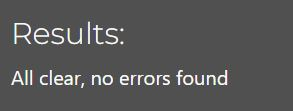
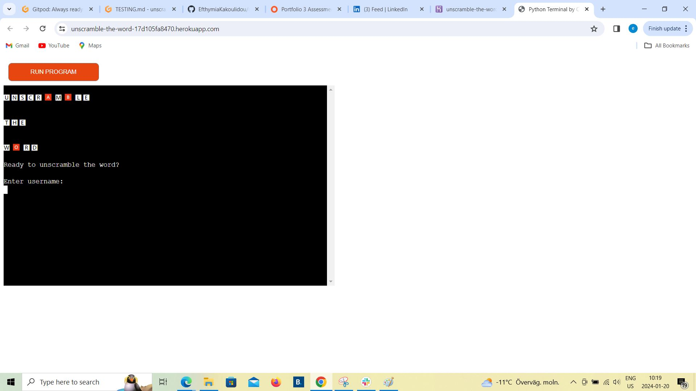
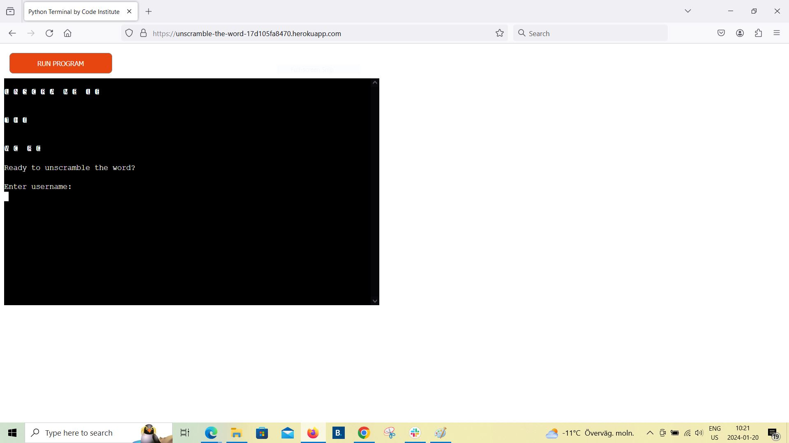
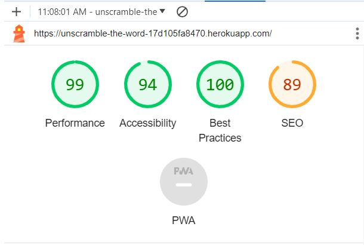
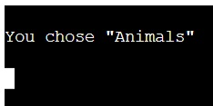
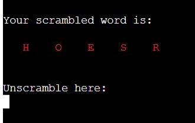
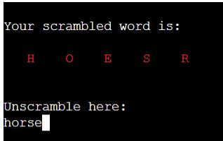
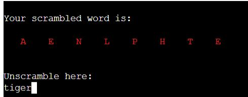
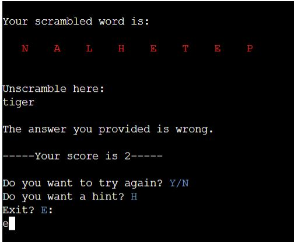
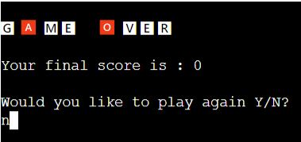

# Testing

## Code Validation

### Python

I have used the recommended [PEP8 CI Python Linter](https://pep8ci.herokuapp.com) to validate all of my Python files.

| File | CI URL | Screenshot | Notes |
| --- | --- | --- | --- |
| run.py | [PEP8 CI](https://pep8ci.herokuapp.com/https://raw.githubusercontent.com/EfthymiaKakoulidou/unscramble-the-word/main/run.py) |  | W291 trailing whitespace-fixed  |

## Browser Compatibility

I've tested my deployed project on multiple browsers to check for compatibility issues.

| Browser | Image | Notes |
| --- | --- | --- |
| Chrome |  | Works as expected |
| Firefox |  | Font does not appear as expected |
| Edge |  | Works as expected |

## Responsiveness

I've tested my deployed project on multiple devices to check for responsiveness issues (The template is given by CI so I cannot really control the responsiveness).

| Device | Image | Notes |
| --- | --- | --- |
| Desktop |  | Works as expected |
| Mobile |  | Works as expected |
| Mobile |  | Works as expected |

## Lighthouse Audit

I've tested my deployed project using the Lighthouse Audit tool to check for any major issues.

| Game | Desktop | Notes |
| --- | --- | --- |
| Game |  | No warnings |

## Defensive Programming

Defensive programming was manually tested with the below user acceptance testing:

| Function | Expectation | Test | Result | Fix | Screenshot |
| --- | --- | --- | --- | --- | --- |
| Username | | | | | |
| | Feature is expected to display username when the user writes it | Tested the feature by typing a name | The feature behaved as expected, and it printed the username | Test concluded and passed |  |
| | Feature is expected to display username when the user writes it | Tested the feature by writing numbers | The feature gives an error | I handled the error by setting it to "the answer is invalid" |   |
| Category choice | | | | | |
| | Feature is expected to accept just the numbers 1,2 or 3 as an answer | Tested the feature by typing 1,2 or 3 | The feature behaved as expected, and it chose a category | Test concluded and passed |  |
| | Feature is expected to accept just the numbers 1,2 or 3 as an answer | Tested the feature by typing anything else | The feature throws an error | I handled the error with the message that the answer is invalid and the option for the player to try again. |  |
| Scramble the word | | | | | |
| | Feature is expected to take a word from the category chosen and shuffle its letters | Tested the feature by playing | The feature behaved as expected, and it printed the shuffled word | Test concluded and passed |  |
| Validation of the player's answer| | | | | |
| | Feature is expected to check if the player's answer is correct or not and give the points accordingly| Tested the feature by giving the right answer | The feature behaved as expected, and it printed that it is correct gave the player 2 points and moved on to the next word | Test concluded and passed |   |
| | Feature is expected to check if the player's answer is correct or not | Tested the feature by giving the wrong answer | The feature behaved as expected and gave the player the 4 options(retry, skip, hint and exit) | Test concluded and passed |   |
| If the player's answer is wrong he gets the 4 options "Y", "N", "H", "E" | | | | | |
| | If the player types "Y" | Tested the feature by typing "Y" | The feature behaved as expected, and it gave the player another try. | Test concluded and passed |  |
| | If the player types "N" | Tested the feature by typing "N" | The feature behaved as expected, and moved on to the next word. | Test concluded and passed |   |
| | If the player types "H" | Tested the feature by typing "H" | The feature behaved as expected, and gave the player the hint. | Test concluded and passed |   |
| | If the player types "E" | Tested the feature by typing "E" | The feature behaved as expected, and exited the game | Test concluded and passed |  |
| | If the player does not type "Y", "N", "H", "E" | Tested the feature by typing something else | The feature behaved as expected, and throwed an error that the answer is invalid. | Test concluded and passed |  |
| If the player's answer is still wrong after the first time around and after getting a hint he gets again 4 options "Y", "N", "H", "E" only this time the option offering a hint becomes an option to be reminded of the hint.
| | If the player types "H" | Tested the feature by typing "H" | The feature behaved as expected, and reminded the player of the hint. | Test concluded and passed |   |
| Play again| | | | | |
| | After played all the words the feature is expected to check if the player wants to play again.| Tested the feature by typing "Y" | The feature behaved as expected, and it restarted the game | Test concluded and passed |  |
| | After played all the words the feature is expected to check if the player wants to play again.| Tested the feature by typing "N" | The feature behaved as expected, and exited the game | Test concluded and passed |  |
| | After played all the words the feature is expected to check if the player wants to play again.| Tested the feature by typing something else | The feature behaved as expected, and printed that the answer is invalid | Test concluded and passed |  |

## User Story Testing

| User Story | Screenshot |
| --- | --- |
| As a new site user, I would like to play, so that I can have fun. | 
| As a new site user, I would like to check how many points I can get out of 10. | 
| As a returning site user, I would like to beat my last high score or my friends'. | 
| As a returning site user, I would like to find out the answers to the words I did not get right.|

## Bugs

- `E501 line too long`

    - To fix this, I used the following syntax:
    

-   A bug that I got while developing project is that sometimes the word was shuffled back to the original word. I did not want that to happen so I added the code to reshuffle the word if it was identical to the original word.
-   Something that I also tried during developing was to add a timer. I tried using threading to run 2 functions simultaneously. That caused many issues and I decided not to use it in the end. 
-   After putting my project up for review on the #peer code review I got some feedback.
    One of the comments was that the player's choices should be more clear so I made the capital letters red to stand out more.
    Another comment was that the blank answer was not handled as an error but it is taken a wrong answer. I fixed that by handling the blank answer as an error.

## Unfixed Bugs

There are no remaining bugs that I am aware of.
